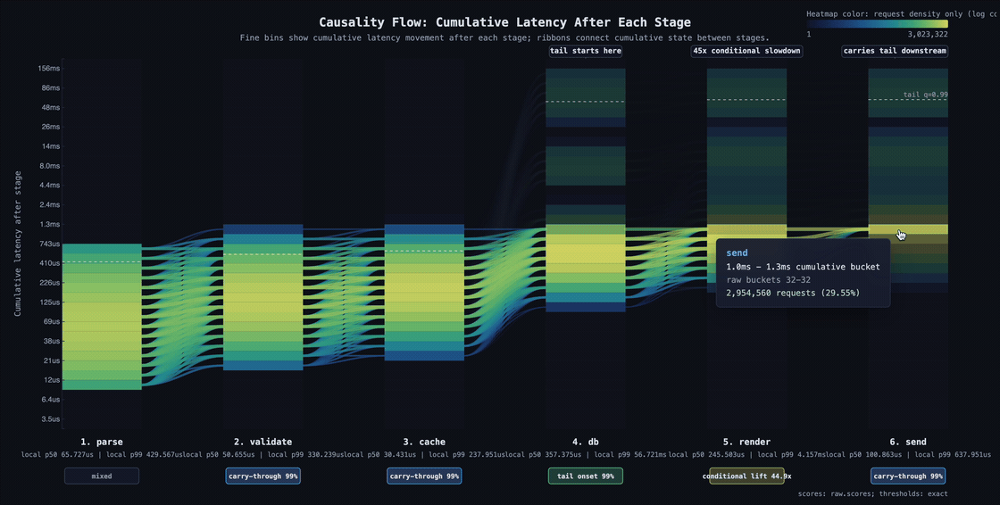

# Tracegrams

Tracking Tail Latency Propagation Without Storing Traces

Histograms are cheap to maintain and great at showing aggregate latency, but they do not explain why requests got slow. Traces preserve the full causal story of a single request, but at scale they are expensive, can hurt the hot path and are hard to aggregate, sample, and retain.

Can we get the best of both worlds without breaking the bank? Maybe.

Tracegrams are a lightweight measurement primitive: each request carries a tiny piece of latency state, and checkpoints along the request path update transition histograms. The aim is to see where p99 latency is born, where it gets amplified, and where it is carried downstream, all online, with minimal overhead for the application itself.

I'll show a Rust prototype, synthetic stress tests with known ground truth, a negative-control scenario, nanoseconds-per-checkpoint overhead numbers, and a path from prototype to a crate that can be used in async Rust services and evaluated on real OSS benchmarks.
